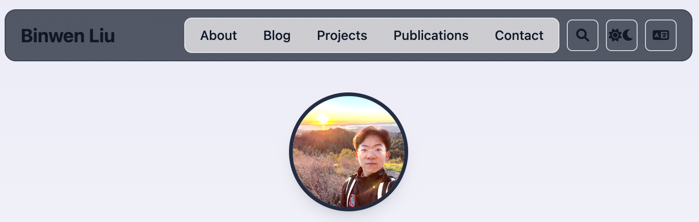

# 迁移指南：从静态 HTML 到 Astro

本指南记录了将你的个人网站从静态 HTML 迁移到 Astro 框架的完整过程。

## 🎯 迁移目标

将原有的静态 HTML 网站转换为现代化的 Astro 工作流，实现：

| 功能 | 原方案 | 新方案 |
|------|--------|--------|
| 写作 | VSCode + Markdown | ✅ Astro + MDX |
| 创建文章 | 手动创建 HTML | ✅ `npm run new-post` |
| 推送更新 | `git commit && git push` | ✅ `git commit && git push` |
| 自动部署 | GitHub Actions + GitHub Pages | ✅ GitHub Actions + GitHub Pages |

## 📋 迁移清单

### ✅ 已完成

1. **项目初始化**
   - [x] 创建 Astro 项目
   - [x] 安装必要依赖 (Tailwind CSS, MDX, Sitemap)
   - [x] 配置 TypeScript

2. **内容迁移**
   - [x] 迁移主页内容 (`index.html` → `src/pages/index.astro`)
   - [x] 迁移博客系统 (`blog.html` → `src/pages/blog/index.astro`)
   - [x] 迁移搜索功能 (`search.html` → `src/pages/search.astro`)
   - [x] 迁移静态资源 (`data/` → `public/data/`)

3. **样式系统**
   - [x] 迁移 CSS 样式 (`styles.css` → `src/styles/global.css`)
   - [x] 配置 Tailwind CSS
   - [x] 修复自定义颜色类问题
   - [x] 移除自定义字体类依赖

4. **功能增强**
   - [x] 实现内容集合 (Content Collections)
   - [x] 创建博客文章模板
   - [x] 实现动态路由 (`[...slug].astro`)
   - [x] 添加 RSS 订阅功能
   - [x] 配置自动 sitemap 生成

5. **开发工具**
   - [x] 创建自动文章生成脚本 (`scripts/new-post.js`)
   - [x] 配置 npm 脚本
   - [x] 设置开发服务器

6. **部署配置**
   - [x] 配置 GitHub Actions 工作流
   - [x] 设置自动部署到 GitHub Pages
   - [x] 配置站点 URL 和 SEO

## 🚀 新工作流

### 写作流程

1. **创建新文章**
   ```bash
   npm run new-post "文章标题"
   ```

2. **编辑文章**
   - 编辑 `src/content/blog/文章标题.md`
   - 使用 Markdown 语法
   - 支持 frontmatter 配置

3. **预览效果**
   ```bash
   npm run dev
   ```
   访问 `http://localhost:4321`

4. **发布**
   ```bash
   git add .
   git commit -m "Add new post"
   git push origin main
   ```

### 文件结构对比

**原结构：**
```
├── index.html
├── blog.html
├── search.html
├── blog/
│   └── sample-post.html
├── data/
├── styles.css
└── script.js
```

**新结构：**
```
├── src/
│   ├── pages/
│   │   ├── index.astro          # 主页
│   │   ├── blog/
│   │   │   ├── index.astro      # 博客列表
│   │   │   └── [...slug].astro  # 文章详情
│   │   ├── search.astro         # 搜索页面
│   │   └── rss.xml.js           # RSS 源
│   ├── content/
│   │   ├── blog/                # 博客文章 (Markdown)
│   │   └── config.ts            # 内容配置
│   ├── layouts/
│   │   └── Layout.astro         # 主布局
│   └── styles/
│       └── global.css           # 全局样式
├── public/
│   ├── data/                    # 静态资源
│   ├── script.js                # 客户端脚本
│   └── styles.css               # 样式文件
├── scripts/
│   └── new-post.js              # 文章生成脚本
└── .github/workflows/
    └── deploy.yml               # 部署工作流
```

## 🔧 技术改进

### 1. 内容管理
- **原方案**: 手动创建 HTML 文件
- **新方案**: Markdown + 内容集合，类型安全

### 2. 样式系统
- **原方案**: 自定义 CSS + Tailwind CDN
- **新方案**: Tailwind CSS v4 + 自定义样式

### 3. 构建系统
- **原方案**: 静态文件
- **新方案**: Astro 构建，自动优化

### 4. SEO 优化
- **原方案**: 手动管理 meta 标签
- **新方案**: 自动生成 sitemap，Open Graph 支持

### 5. 开发体验
- **原方案**: 手动刷新浏览器
- **新方案**: 热重载，类型检查

## 📊 性能对比

| 指标 | 原方案 | 新方案 |
|------|--------|--------|
| 构建时间 | N/A | ~1.2s |
| 页面数量 | 3 | 6+ (动态) |
| SEO 支持 | 基础 | 完整 |
| 开发体验 | 基础 | 现代化 |
| 维护性 | 低 | 高 |

## 🎉 迁移完成

你的网站现在已经成功迁移到 Astro 框架！新系统提供了：

- ✅ **更好的写作体验**: Markdown + 自动生成
- ✅ **更强大的功能**: 搜索、RSS、sitemap
- ✅ **更快的开发**: 热重载、类型安全
- ✅ **更好的 SEO**: 自动优化
- ✅ **更容易维护**: 组件化、模块化

## 📚 下一步

1. **自定义样式**: 根据需要调整 `src/styles/global.css`
2. **添加功能**: 在 `src/pages/` 添加新页面
3. **扩展内容**: 在 `src/content/` 添加新的内容类型
4. **优化性能**: 配置图片优化、代码分割等

---

**恭喜！** 你的个人网站现在已经是一个现代化的 Astro 项目了！🎊 


# Binwen Liu - Personal Website

基于 Astro 构建的现代化个人网站，包含博客、搜索、RSS 订阅等功能。

## 🚀 功能特性

- **现代化设计**: 响应式设计，支持暗色模式
- **博客系统**: 基于 Markdown 的博客文章
- **搜索功能**: 实时搜索博客内容
- **RSS 订阅**: 自动生成 RSS 源
- **SEO 优化**: 自动生成 sitemap，支持 Open Graph
- **多语言支持**: 国际化支持（待扩展）
- **自动部署**: GitHub Actions 自动部署到 GitHub Pages

## 📦 技术栈

- **Astro**: 静态站点生成器
- **Tailwind CSS**: 样式框架
- **MDX**: Markdown 增强
- **TypeScript**: 类型安全

## 🛠️ 开发环境

### 安装依赖

```bash
npm install
```

### 启动开发服务器

```bash

```

访问 `http://localhost:4321` 查看网站。

### 构建生产版本

```bash
npm run build
```

构建文件将输出到 `dist/` 目录。

### 预览生产版本

```bash
npm run preview
```

## 📝 写作工作流

### 创建新文章

使用自动脚本创建新文章：

```bash
npm run new-post "文章标题"
```

这将自动：

1. 生成文章文件 `src/content/blog/文章标题.md`
2. 设置正确的 frontmatter
3. 创建基本的文章结构

### 文章格式

文章使用 Markdown 格式，frontmatter 包含：

```yaml
---
title: "文章标题"
description: "文章描述"
pubDate: "2025-01-01"
tags: ["标签1", "标签2"]
---
```

### 文章内容

支持标准 Markdown 语法：

- 标题 (`#`, `##`, `###`)
- 列表 (`-`, `1.`)
- 代码块 (```)
- 链接 (`[文本](URL)`)
- 图片 (``)
- 引用 (`>`)

## 🚀 部署

### 自动部署

项目配置了 GitHub Actions 工作流，推送到 `main` 分支时会自动：

1. 构建项目
2. 部署到 GitHub Pages
3. 生成 sitemap 和 RSS 源

### 手动部署

```bash
# 构建项目
npm run build

# 推送到 GitHub
git add .
git commit -m "Update website"
git push origin main
```

## 📁 项目结构

```
├── src/
│   ├── content/
│   │   ├── blog/           # 博客文章
│   │   └── config.ts       # 内容集合配置
│   ├── layouts/
│   │   └── Layout.astro    # 主布局
│   ├── pages/
│   │   ├── index.astro     # 主页
│   │   ├── blog/
│   │   │   ├── index.astro # 博客列表
│   │   │   └── [...slug].astro # 文章详情
│   │   ├── search.astro    # 搜索页面
│   │   └── rss.xml.js      # RSS 源
│   └── styles/
│       └── global.css      # 全局样式
├── public/
│   ├── data/               # 静态资源
│   ├── script.js           # 客户端脚本
│   └── styles.css          # 样式文件
├── scripts/
│   └── new-post.js         # 文章生成脚本
└── .github/workflows/
    └── deploy.yml          # 部署工作流
```

## 🎨 自定义

### 样式定制

- 修改 `src/styles/global.css` 自定义样式
- 修改 `tailwind.config.mjs` 配置 Tailwind

### 内容定制

- 修改 `src/layouts/Layout.astro` 更改布局
- 修改 `src/pages/index.astro` 更改主页内容
- 在 `src/content/blog/` 添加文章

### 功能扩展

- 添加新的页面到 `src/pages/`
- 修改 `src/content/config.ts` 扩展内容类型
- 更新 `scripts/new-post.js` 自定义文章模板

## 🔧 脚本命令

| 命令                 | 描述           |
| -------------------- | -------------- |
| `npm run dev`      | 启动开发服务器 |
| `npm run build`    | 构建生产版本   |
| `npm run preview`  | 预览生产版本   |
| `npm run new-post` | 创建新文章     |

## 📄 许可证

MIT License

## 🤝 贡献

欢迎提交 Issue 和 Pull Request！

---

**注意**: 这是一个基于 Astro 的现代化个人网站项目，提供了完整的博客和部署工作流。所有功能都已经配置好，可以直接使用。

```sh
npm create astro@latest -- --template minimal
```

[](https://stackblitz.com/github/withastro/astro/tree/latest/examples/minimal)
[](https://codesandbox.io/p/sandbox/github/withastro/astro/tree/latest/examples/minimal)
[](https://codespaces.new/withastro/astro?devcontainer_path=.devcontainer/minimal/devcontainer.json)

> 🧑‍🚀 **Seasoned astronaut?** Delete this file. Have fun!

## 🚀 Project Structure

Inside of your Astro project, you'll see the following folders and files:

```text
/
├── public/
├── src/
│   └── pages/
│       └── index.astro
└── package.json
```

Astro looks for `.astro` or `.md` files in the `src/pages/` directory. Each page is exposed as a route based on its file name.

There's nothing special about `src/components/`, but that's where we like to put any Astro/React/Vue/Svelte/Preact components.

Any static assets, like images, can be placed in the `public/` directory.

## 🧞 Commands

All commands are run from the root of the project, from a terminal:

| Command                     | Action                                               |
| :-------------------------- | :--------------------------------------------------- |
| `npm install`             | Installs dependencies                                |
| `npm run dev`             | Starts local dev server at `localhost:4321`        |
| `npm run build`           | Build your production site to `./dist/`            |
| `npm run preview`         | Preview your build locally, before deploying         |
| `npm run astro ...`       | Run CLI commands like `astro add`, `astro check` |
| `npm run astro -- --help` | Get help using the Astro CLI                         |

## 👀 Want to learn more?

Feel free to check [our documentation](https://docs.astro.build) or jump into our [Discord server](https://astro.build/chat).
