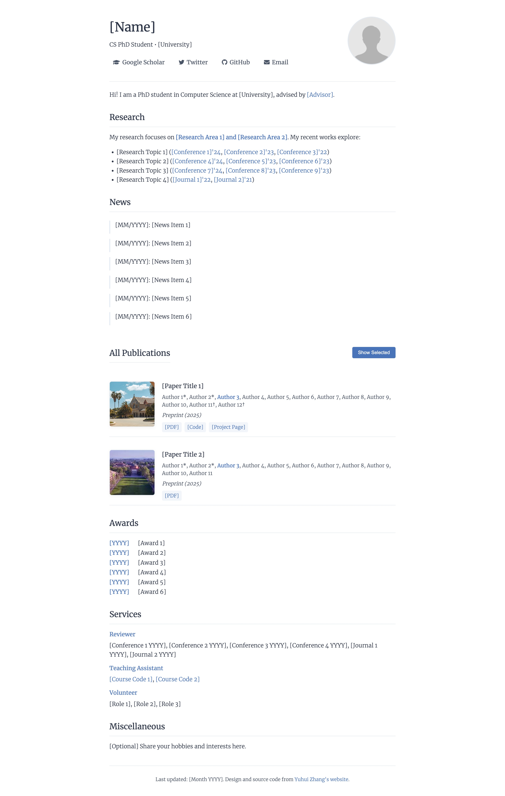

# Minimal Academic Website Template

A clean, minimal academic website template, designed for researchers and PhD students. The design and source code are from [Yuhui Zhang](https://cs.stanford.edu/~yuhuiz/).



## Features

- Minimalist, academic-focused design
- Responsive layout
- Easy to customize
- SEO-friendly meta tags
- Publication showcase support

## Quick Start

0. Clone this repository and `cd` into the directory
1. Run `python -m http.server` and visit `http://localhost:8000`
2. Replace placeholders marked with `[brackets]` in `index.html`
3. Update profile photo in `images/profile.jpeg`
4. Modify `publications.json` for your papers
5. Customize sections as needed (About, Research, News, etc.)

## Sync the Obsidian blog

The Blog is generated from the local Obsidian vault at
`/Users/binwen6/Obsidian/Study Notes`.

```bash
# First run only: add a checked publishing control to every note, then sync
node tools/sync-obsidian.mjs --init-publish-flags

# Normal updates
node tools/sync-obsidian.mjs
```

Each note begins with `- [x] Publish on personal website`. Change it to
`- [ ] Publish on personal website` to remove that note from the next sync.
The generated `blog-index.json` and `blog/obsidian/` directory should be
committed with the rest of the website.

## File Structure

```
.
├── index.html          # Main webpage
├── styles.css          # CSS styling
├── scripts.js          # JavaScript for dynamic content
├── publications.json   # Publication data
└── images/            # Image assets
    └── profile.jpg
```

## License

MIT License

---

For a live example, visit [Yuhui Zhang's website](https://cs.stanford.edu/~yuhuiz/).
