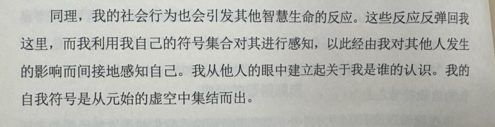
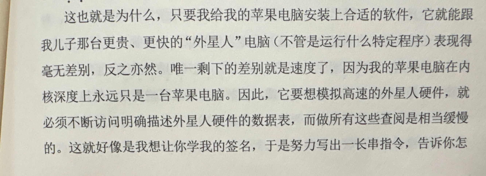

# 时间线

在过去的第二周，工作中心主要放在科研日常上。从成都回来后，拾起暂时搁置的任务，主要在手术视频帧分割任务以及音乐脑机benchmark的工作上做出一些推进。

本科生的期末周已临近尾声，空闲教室也变得随处可见，于是就可以把实验随地大小跑(bushi)。对不同版本的模型代码进行反复尝试后，终于筛选出了三个适合横向比较的分割模型，且性能上足够跑出一个客观的dice score。于是开始进行data prep -> training -> evaluation -> predicting一整套pipeline，并最终把结果以ppt的形式可视化地呈现出来。这周脑解码的组会上，也是大家的第一次组会，聆听了博士师兄们的汇报后，感到大有可为。对我而言印象最深刻的点，一个是模型流程框图的设计和公式的构造，还有就是导师的拷打了(lol)。领到了下一周的任务后，便开始讨论分工，对eeg信号的解码及其下游任务上开展新近顶会论文的调研。

上周还和女朋友一起探索了一家超大的网红书店和省图书馆(之前我们都没去过)，感受比较好的应该是省图了。在自助检索机器上找到了我挚爱的侯世达先生的《我是个怪圈》以及《表象与本质》这两部作品。一下午的时间主要用于阅读前者，随手记下了一些阅读思考：

## 技术问题

得益于大佬的推荐，订阅了Cursor的月度会员准备浅浅尝试一下效果。不过在使用免费版时，我也摸索出了一些规律：比如使用Cursor（尤其是在连接的服务器上）优先使用Command+K的上下文代码补全功能，速度比对话框提问快很多（虽然缺乏多轮交互），但只要你的描述足够精细，效果会喜出望外。

## 结语

> “Meaning is not a thing that one can look up, but rather something that arises only in a complex web of associations.”
> —— Douglas Hofstadter

---

*This post was created using the automated script.*
